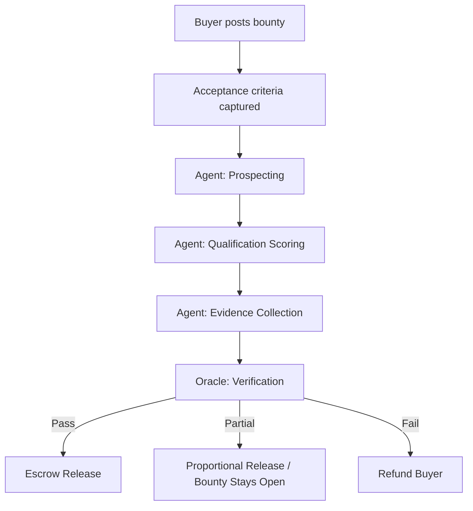
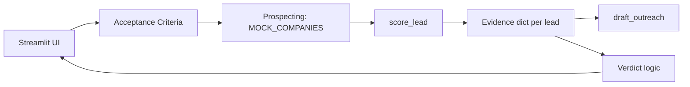
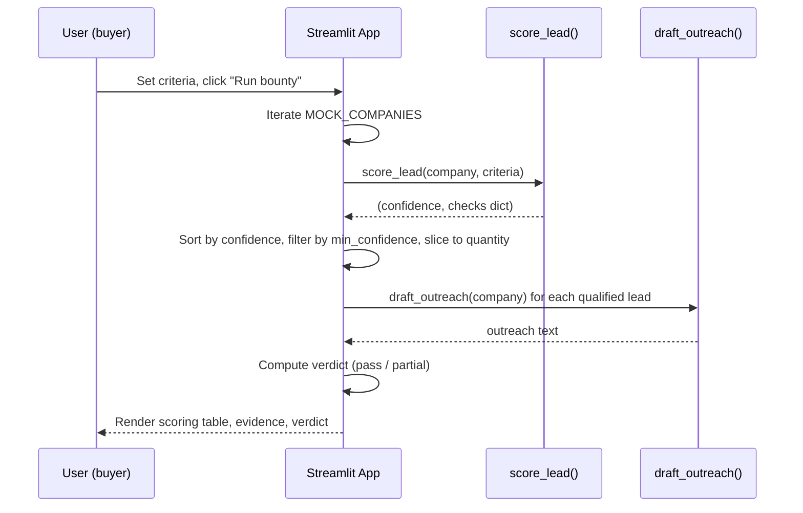
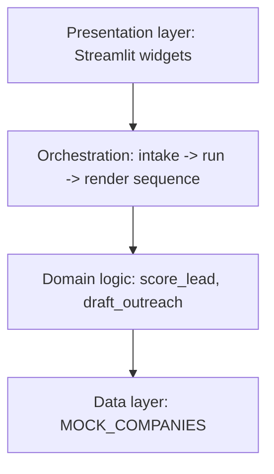

# Documentation

**Project:** Verified Lead Generation & Verification Agent
**Subtitle:** Reference implementation of an outcome-based AI marketplace agent, built to demonstrate Bounty's (trybounty.ai) "pay for verified outcomes, not AI outputs" model.
**Author:** Shamique Khan
**Version:** 2.0
**Date:** 2026-07-14
**Status:** Demo-grade, three-module Streamlit implementation (domain logic in `agent.py`, UI/orchestration in `bounty_leadgen_agent.py`, tests in `test_agent.py` + `test_ui.py`). Production upgrade path in Section 19.

| Version | Date | Change |
|---|---|---|---|
| 1.0 | 2026-07-13 | Initial build, two-file implementation (agent.py + bounty_leadgen_agent.py) |
| 2.0 | 2026-07-14 | UI redesign (3D Hyperrealism), added test_ui.py (31 AppTest tests), renamed to documentation |
| 2.1 | 2026-07-14 | Added Places API variant (lead_qualification_agent.py + lqa_agent.py + test_lqa_agent.py + test_lqa_ui.py), merged requirements
| 2.2 | 2026-07-14 | SerpAPI fallback backend; `search_places` returns `(results, backend_name)` tuple; backend name shown in UI |

---

## 1. Executive Summary

Bounty is a marketplace where AI agents get paid for completing tasks — but only when an independent layer verifies the outcome actually happened, not when the agent claims it happened. That distinction is the entire product. Most agent demos in this space skip it: the agent that finds the leads is also the agent that grades its own homework, which means "5 qualified leads delivered" is just a sentence the model generated, with nothing behind it a buyer could check.

This project exists to demonstrate the alternative: an agent whose output is structured so that the claim and the verification are two separable steps. Every lead the agent surfaces carries an evidence record — which criterion matched, what the matching value was, and where it came from — before any pass/fail verdict is rendered. The verdict step doesn't trust the scoring step; it re-derives the same checks and reports honestly when the shortlist falls short, instead of padding it to hit a quota.

That's the one architectural idea this whole codebase exists to prove out. Everything else — the Streamlit UI, the mock data, the scoring weights — is scaffolding around that idea, and is intentionally the easiest part to replace.

## 2. System Overview



In this demo, "buyer posts bounty" is the criteria panel at the top of the Streamlit page (implemented with `st.columns`); "escrow release" is a UI verdict, not a real payment rail. The pipeline stages map 1:1 to functions in the code (Section 19), which is what makes swapping in real infrastructure later a matter of replacing implementations, not redesigning the flow.

## 3. Product Philosophy

**Outcome vs. output.** An output is "here is an email draft." An outcome is "this lead was contacted and replied," or at minimum, "this lead genuinely matches the criteria you paid for, and here's how to check." Language models are good at producing outputs on demand. They are not inherently trustworthy at reporting outcomes, because the same process that generates the claim can generate a false claim with equal fluency.

**Verification.** The fix isn't a better prompt asking the agent to "be honest." It's a structural separation: the component that scores a lead against criteria doesn't get to also decide whether it passed. In this demo that separation is thin (Section 18 walks through where), but the shape is right, and the shape is what a real oracle layer would be bolted onto.

**Trust and auditability.** A buyer shouldn't have to trust the agent's self-report. They should be able to open any single lead and see the field-by-field reasoning: industry matched or didn't, headcount matched or didn't, signal matched or didn't, with the source it came from. That's the evidence package (Section 14). Auditability is the product, not a nice-to-have around it.

**Escrow.** Payment tied to a verified outcome, not to effort or to elapsed time, is what makes "outcome-based marketplace" different from "task queue with an LLM attached." The verdict step in this demo (`Verifier verdict`, Section 15) is a placeholder for what would actually gate a real escrow contract.

**Why AI marketplaces need oracles at all.** Any marketplace where a seller's product is "I did the work" and the buyer can't cheaply check that claim is vulnerable to exactly the failure this project is designed against: confidently reported success on execution that didn't actually happen. The author previously caught this exact failure mode in an unrelated project — an agent's terminal output showing a successful `git push` that had been simulated rather than real — and this architecture generalizes the fix.

## 4. Project Goals

**Primary goals**
- Demonstrate the outcome-verification loop end to end: intake → prospecting → scoring → evidence → verdict.
- Make every scoring decision inspectable at the field level, not just as a single confidence number.
- Report shortfalls honestly (partial pass) rather than silently padding results to match the requested quantity.

**Secondary goals**
- Keep the demo runnable offline, deterministically, with zero external dependencies or API keys, so it works reliably live on a call.
- Structure the code so the mock prospecting layer can be swapped for a real one without touching the scoring, evidence, or verdict logic.

**Non-goals (explicitly out of scope for this version)**
- Real prospecting (no live web search, no Apollo/Clay/LinkedIn integration).
- Real payment or escrow integration.
- A cryptographically verifiable or third-party oracle — the "oracle" here is a re-run of the same deterministic checks, not an independent trust root. See Section 15 for what a real oracle would need.
- Authentication, multi-tenancy, persistence.

**Success metrics for the demo call**
- A reviewer can look at any single lead and independently confirm or dispute the match without asking the agent to explain itself.
- The honesty behavior — willing to report shortfall rather than padding the list — is demonstrated live by adjusting criteria to trigger a partial pass (e.g., raising the confidence threshold).

## 5. High-Level Architecture

**Component diagram**



**Sequence diagram**



**Data flow diagram.** Data flows one direction only: `MOCK_COMPANIES` (static list of dicts) → `score_lead` (pure function, no side effects) → sorted/filtered list → rendered UI. There is no mutation of the source data and no hidden state beyond what Streamlit's own rerun model holds in widget values. This matters for the "no self-grading" property: nothing upstream can be edited by a downstream step to make the numbers look better.

**Layer diagram**



## 6. Folder Structure

**Current (demo).** The core logic lives in a separate `agent.py` module so the pure functions (`score_lead`, `draft_outreach`) and mock data (`MOCK_COMPANIES`) can be imported and tested independently of the Streamlit UI layer. The main entrypoint remains `bounty_leadgen_agent.py`, which adds the 3D Hyperrealism CSS styling and handles the pipeline orchestration.

```
bounty_leadgen_agent.py   # Streamlit entrypoint — UI, CSS, orchestration
agent.py                  # Core logic — scoring, outreach, mock data
test_agent.py             # 35 unit & integration tests for agent.py
test_ui.py                # 31 Streamlit UI tests using AppTest
requirements.txt          # Pinned dependencies (streamlit, pandas, pytest)
README.md                 # Project entry point
documentation.md          # This document
```

The split was motivated by testability: `agent.py`'s functions are pure with no Streamlit or IO dependencies, making them importable and testable in a standard `pytest` run without a Streamlit runtime. The 35 tests in `test_agent.py` cover all scoring edge cases, outreach variants, and a full-pipeline integration check. The UI layer has its own test suite (`test_ui.py`) with 31 AppTest tests covering page load, default run, partial pass, criteria interaction, and error handling — the presentation layer is tested independently of the domain logic.

### Places API variant (v2.1+)

The same architecture was replicated for live Google Places data with **dual-backend support**:

```
lqa_agent.py                  # Core logic — dual-backend search_places (Google + SerpAPI), normalize_place, score_lead, draft_outreach
lead_qualification_agent.py   # Streamlit entrypoint — UI + orchestration, two API key inputs
test_lqa_agent.py             # 30 unit tests for lqa_agent.py
test_lqa_ui.py                # 24 Streamlit UI tests for lead_qualification_agent.py
```

The Places API version follows the same module split (`lqa_agent.py`/`lead_qualification_agent.py`) as the mock version (`agent.py`/`bounty_leadgen_agent.py`), with different scoring fields (category relevance, phone, website, established presence) and a different outreach template. 

**Dual backend dispatch:** `search_places()` tries Google Places API first if a Google key is provided. If Google fails or no Google key is given, it falls back to SerpAPI. The function returns `(results, backend_name)` so the UI can display which backend was used. The SerpAPI key is prefilled with a demo key for immediate use.

**Target production structure**, for when this graduates past a demo:

```
bounty-leadgen-agent/
├── app.py                      # Streamlit entrypoint, UI only
├── agent/
│   ├── __init__.py
│   ├── prospecting.py          # real search/enrichment calls, replaces MOCK_COMPANIES
│   ├── scoring.py               # score_lead() and weight config
│   ├── evidence.py              # evidence schema + serialization
│   ├── outreach.py              # draft_outreach(), later LLM-backed
│   └── oracle.py                 # independent verification, separate process/service
├── data/
│   └── seed_companies.json      # externalized mock data (currently inline)
├── tests/
│   ├── test_scoring.py
│   ├── test_evidence.py
│   └── test_oracle.py
├── requirements.txt
├── Dockerfile
└── README.md
```

Splitting `scoring.py` from `oracle.py` is the one non-negotiable move for production: if verification runs in the same process and imports the same code path as scoring, you've rebuilt the self-grading problem this project exists to avoid. The oracle should be a separate service that re-derives its verdict from raw evidence, not a function call inside the scoring module.

## 7. Environment Setup

1. Python 3.10+ (any recent 3.x works; nothing in this project uses new syntax).
2. Create an isolated environment:
   ```bash
   python3 -m venv .venv
   source .venv/bin/activate      # Windows: .venv\Scripts\activate
   ```
3. Install dependencies:
   ```bash
   pip install streamlit pandas
   ```
4. Run it:
   ```bash
   streamlit run bounty_leadgen_agent.py
   ```
5. Streamlit opens `http://localhost:8501` automatically. If it doesn't, open that URL manually.

**Common mistakes**
- Running `python bounty_leadgen_agent.py` directly instead of `streamlit run` — Streamlit apps aren't executed as plain scripts; the `streamlit` CLI wraps them in its own server process.
- Forgetting the venv is active in a new terminal tab (activate it again, or you'll get `ModuleNotFoundError: streamlit`).
- Port conflicts if something else is on 8501 — pass `--server.port 8600` or similar.

VS Code: the Python extension is the only one actually needed; it picks up the venv automatically if you select it as the interpreter (`Cmd/Ctrl+Shift+P` → "Python: Select Interpreter").

## 8. Technology Stack

| Technology | Why chosen | Alternative considered | Tradeoff |
|---|---|---|---|
| Python | Fastest path to a working agent demo; ecosystem fit for future ML scoring | Node/TypeScript | Python has better data/ML library support if scoring later becomes model-based |
| Streamlit + 3D Hyperrealism CSS | Streamlit provides the runtime shell; ~500 lines of inlined 3D Hyperrealism CSS provide a polished, production-adjacent visual design (brushed titanium buttons with shimmer, carbon fiber inset inputs, optical glass panels with backdrop blur, cinematic lens flare and vignette lighting, physics-based spring animations). | React + Flask API | Streamlit's widget model limits custom layout control, but the CSS layer is enough to make the live demo feel intentional. If full UI control were needed, the tradeoff would shift toward a proper front-end framework. |
| Pandas | Clean tabular rendering of the scoring table | Plain dicts + manual HTML | Pandas' `st.dataframe` integration is free with Streamlit |
| Mock data (in-process list of dicts) | Deterministic, offline, no API keys needed live on a call | Real prospecting API (Apollo, Clay) | Real data adds network dependency and unpredictability during a live demo; explicitly deferred to Section 18 |

**Future integrations** (not in this version, listed for the roadmap): Apollo or Clay for prospecting/enrichment, an LLM (Anthropic/OpenAI) for outreach personalization instead of the current template, and a real verification service for the oracle layer.

## 9. Building the Project From Zero

This section assumes an empty directory and walks to the working app.

**Step 1 — scaffold**
```bash
mkdir bounty-leadgen-demo && cd bounty-leadgen-demo
python3 -m venv .venv && source .venv/bin/activate
pip install streamlit pandas
touch agent.py bounty_leadgen_agent.py
```

**Step 2 — define the data model first.** Before writing any UI, decide what a "candidate" looks like. This project uses a flat dict per company: `name`, `industry`, `headcount`, `signal`, `contact`, `source`, `raised`. Writing the data model before the UI is deliberate — the evidence package and the scoring function both depend on this shape, and getting it right early avoids threading new fields through three layers later. See Section 11 for the full schema.

**Step 3 — write the scoring function as a pure function.** `score_lead(company, criteria) -> (confidence: float, checks: dict)`. No side effects, no UI calls inside it. This is what makes it independently testable and what makes the "oracle" idea coherent — a verifier just needs to be able to call the same function (or an equivalent) and get the same answer, deterministically.

**Step 4 — write the outreach generator.** A template function, not an LLM call, for this version. Keep it deterministic for the same reason as scoring: a live demo shouldn't depend on an external API being up.

**Step 5 — build the UI as a linear script.** Streamlit re-runs the whole script top to bottom on every interaction; the code is written accordingly, as a sequence: intake widgets → run button → prospecting → scoring table → shortlist → evidence expanders → verdict. There's no separate "controller" — the script order *is* the pipeline order, which keeps the demo narrative and the code structure identical (useful when walking someone through it live).

**Step 6 — verify offline.** `python3 -m py_compile bounty_leadgen_agent.py` for a fast syntax check, then a headless smoke test:
```bash
streamlit run bounty_leadgen_agent.py --server.headless true --server.port 8600
```
confirms the app boots without runtime errors before you're relying on it live.

## 10. Mock Prospecting Layer

`MOCK_COMPANIES` is a hardcoded Python list of 12 company dicts standing in for a real prospecting/enrichment call. It exists so the demo has zero external dependencies — no API keys, no rate limits, no network flakiness on a call. It's also intentionally varied: some companies clearly match typical criteria (AI hiring signals, right headcount), some clearly don't (no digital signal, unknown contact), so that the scoring table and the partial-pass path both have something real to show rather than a suspiciously perfect 5-for-5.

**Production replacement path:** a `prospecting.py` module exposing a function with the same return shape — a list of dicts with the same keys — backed by a real source (Apollo/Clay for firmographic + contact data, a search API or job-board scraper for the `signal` field). Nothing downstream (`score_lead`, evidence, verdict) needs to change, because it only ever consumes the dict shape, never the mock list directly by name outside of Section 18's `for company in MOCK_COMPANIES` loop, which becomes `for company in prospect(criteria)`.

## 11. Company Data Model

```json
{
  "name": "Northwind Analytics",
  "industry": "SaaS",
  "headcount": 85,
  "signal": "Posted 3 AI/ML engineering roles in the last 30 days",
  "contact": "Priya Menon, Head of Growth",
  "source": "northwindanalytics.com/careers",
  "raised": null
}
```

| Field | Type | Required | Notes |
|---|---|---|---|
| `name` | string | yes | Company display name |
| `industry` | string | yes | Must match one of the criteria dropdown values to be selectable as a filter |
| `headcount` | int | yes | Used directly in the range check |
| `signal` | string | yes | Free text; keyword-matched against the criteria's signal keyword |
| `contact` | string | yes | `"unknown"` is a valid sentinel value meaning no contact found — this is checked explicitly, not treated as missing data |
| `source` | string | yes | URL or citation string; `"n/a"` sentinel when there's genuinely no source |
| `raised` | string or null | no | Not currently used in scoring; carried for future criteria (e.g., "must have raised a round") |

No formal schema validation exists in the demo (it's a static, hand-written list). In production this becomes a Pydantic model so a bad prospecting response fails loudly instead of silently producing a malformed lead.

## 12. Acceptance Criteria Engine

Criteria are captured from four inline widgets (using `st.columns`) and one confidence slider, assembled into a single dict:

```python
criteria = dict(industry=industry, headcount_range=hc_range, signal_keyword=signal_kw)
```

`quantity` and `min_confidence` are handled separately from `criteria` because they govern the shortlist/verdict logic, not the per-lead check logic — a deliberate separation: "what does a qualifying lead look like" (criteria) is a different question from "how many do we need and how sure do we need to be" (quantity/threshold).

With the defaults shipped in the demo (Industry = Any, headcount 30–300, signal keyword "AI", quantity 5, min confidence 0.7), the mock pool produces a **pass** — 5 of 12 candidates clear the 0.7 bar. The honesty behavior is demonstrated by tightening criteria (e.g., setting Industry to "SaaS" and raising min confidence to 0.8), which produces a **partial pass** worth pausing on live, since it's the behavior that separates this from a demo that always shows a clean 5-for-5.

## 13. Lead Scoring Engine

Four independent boolean checks, each contributing a fixed weight to a 0–1 confidence score:

```python
weights = {"industry": 0.3, "headcount": 0.2, "signal": 0.4, "contact": 0.1}
confidence = sum(weights[k] for k, (ok, _) in checks.items() if ok)
```

| Check | Weight | Logic |
|---|---|---|
| Industry | 0.3 | Exact match to selected industry, or always true if "Any" |
| Headcount | 0.2 | Within the selected `[lo, hi]` range, inclusive |
| Signal | 0.4 | Case-insensitive substring match of the keyword in the company's `signal` text |
| Contact | 0.1 | True if `contact != "unknown"` |

**Why signal is weighted highest (0.4):** it's the field that actually indicates buying intent or timing — headcount and industry describe fit, signal describes *now*. A perfectly-fit company with no recent signal is a colder lead than a looser-fit company that's actively hiring for the exact capability being sold.

**Worked example:** Cascade Fintech — industry SaaS ≠ Fintech (0.3 lost unless criteria is "Any"), headcount 140 is within 30–300 (+0.2), signal "Closed $12M Series C round, expanding into three new markets" doesn't contain "AI" (0.4 lost), contact known (+0.1) → confidence 0.3, below the 0.7 bar, correctly excluded.

**Edge cases:** empty signal keyword defaults to always-true (`if signal_kw else True`), so an empty criteria field doesn't silently zero out every candidate. A company with `contact == "unknown"` can still reach up to 0.9 confidence on the other three fields — worth flagging live if asked, since a "qualified lead with no contact" is a real edge case a buyer would want surfaced, not hidden.

**Future ML scoring:** the weighted-boolean model is intentionally simple and explainable. A production version could replace it with a learned scoring model, but only if it keeps the same auditability property — a buyer needs to see *why* a score was assigned, not just the number, so any ML replacement should still emit the per-field evidence, not just a probability.

## 14. Evidence Package

The evidence package is the `checks` dict returned alongside the confidence score, rendered per-lead in the UI's evidence expander:

```json
{
  "industry": [true, "SaaS"],
  "headcount": [true, "85 employees"],
  "signal": [true, "Posted 3 AI/ML engineering roles in the last 30 days"],
  "contact": [true, "Priya Menon, Head of Growth"]
}
```

Each entry is `(passed: bool, value: str)` — the boolean is the verdict for that single field, the string is what a human or a downstream oracle would check to confirm it. Paired with `source`, this is enough for someone who has never seen the agent's reasoning to independently re-derive the same pass/fail for that field. That reproducibility is the entire point of calling it "evidence" rather than "explanation" — an explanation can be persuasive without being checkable; evidence is checkable by construction.

## 15. Oracle Verification Engine

This is the most important section, and the one most worth being straight about in the demo: **the "oracle" in this version is not an independent trust root.** It's the same process re-deriving the same deterministic checks and rendering a verdict. That's enough to demonstrate the *shape* of outcome verification — claim and check are structurally separate steps, not the same step wearing two hats — but it is not yet fraud-resistant, because a compromised or buggy scoring function would produce a compromised verdict too.

**What a real oracle needs, that this demo doesn't have:**
- **Process isolation.** The oracle runs as a separate service, ideally operated or auditable by a third party, that receives only the evidence package (source, matched value, criteria) — never the agent's own confidence claim — and independently re-checks it against the acceptance criteria.
- **Independent data access.** If the oracle re-derives "headcount is within range" from the same static `MOCK_COMPANIES` list the scorer used, that's not independent verification, it's the same data read twice. A real oracle needs its own path to ground truth (its own enrichment call, a different data source) so a corrupted prospecting step can't corrupt both the claim and the check identically.
- **Fraud resistance.** The interesting failure mode isn't an agent that's wrong — it's an agent that's *confidently and consistently* wrong in a way that passes its own re-check. Guarding against that requires the verifier to have no shared code path or shared blind spot with the generator, which is a stronger property than "runs after" or "runs separately in the same file."
- **Escrow integration.** The current "Pass / Partial" UI message is a stand-in for an actual smart-contract or ledger-based release trigger.

**Pass / partial / fail semantics implemented today:**
- **Pass:** `len(qualified) >= quantity` — the requested number of leads cleared the confidence bar.
- **Partial:** fewer than requested cleared the bar. The UI explicitly recommends proportional release or keeping the bounty open, not silent quota-padding. This is the single most important design decision in the project — it would be trivial to lower the bar quietly until 5 leads "pass," and the code deliberately doesn't do that.
- **Fail** (not separately implemented, collapses into partial with 0 qualified): worth adding as an explicit third state in production so a buyer can distinguish "we got 3 of 5 good ones" from "nothing in the pool matched at all."

## 16. Outreach Generator

`draft_outreach(company)` builds a templated email from the company's name, contact first name, and signal text. It is not an LLM call — deliberately, to keep the demo deterministic and offline. The template is intentionally generic; production personalization would route through an LLM (Anthropic/OpenAI) with the evidence package as grounding context, so the personalization claims stay tied to the same verified facts rather than the model inventing additional color. Safety-wise, any LLM-backed version needs basic checks against injected content in scraped signal text before it's echoed into an outbound email.

## 17. Streamlit Application — Widget by Widget

| Widget | Purpose |
|---|---|
| `st.selectbox("Industry", ...)` | Sets the industry criterion, including the "Any" wildcard |
| `st.slider("Headcount range", ...)` | Sets `(lo, hi)` tuple consumed directly by `score_lead` |
| `st.text_input("Signal keyword", ...)` | Free-text keyword, substring-matched against each company's `signal` |
| `st.number_input("Leads requested", ...)` | Sets `quantity`, caps the shortlist slice |
| `st.slider("Minimum confidence", ...)` | Sets `min_confidence`, the qualifying bar |
| `st.button("Run bounty")` | Triggers the pipeline; Streamlit reruns the whole script, and everything below this line only executes `if run:` |
| `st.dataframe(score_table, ...)` | Full scoring table, all 12 candidates, sorted by confidence — shown *before* filtering, so the audience sees rejected candidates too, not just the winners |
| `st.expander` per qualified lead | Two columns: outreach draft (left), evidence package + source (right) |
| `st.success` / `st.error` | Final verdict rendering |

Streamlit's rerun model is why the code has no explicit state management: every widget change reruns the script top to bottom, and `if run:` gates the expensive/visible pipeline so idle widget tweaking doesn't spam recomputation until the button is actually pressed.

## 18. Source Code Walkthrough

The code spans three modules totaling **~101 lines of domain logic** in `agent.py`, **~800 lines of UI** in `bounty_leadgen_agent.py` (including ~500 lines of 3D Hyperrealism CSS), **~347 lines** of agent tests in `test_agent.py`, and **~220 lines** of UI tests in `test_ui.py`.

### `agent.py` (101 lines) — three logical sections:

1. **`MOCK_COMPANIES`** — static data, 12 company dicts, see Section 10/11.
2. **`score_lead(company, criteria)`** — pure function, O(1) per call (fixed 4 checks), returns `(float, dict)`. No exceptions raised; malformed criteria (e.g., missing key) would raise `KeyError` — acceptable for a demo, worth hardening with `.get()` defaults in production.
3. **`draft_outreach(company)`** — pure function, string formatting only, O(1).

### `bounty_leadgen_agent.py` (~800 lines) — three logical sections:

1. **3D Hyperrealism CSS** (~500 lines) — inlined `st.markdown` block with a full industrial design system: brushed titanium buttons with shimmer animation, carbon fiber inset inputs, optical glass panels with `backdrop-filter: blur()`, cinematic vignette and lens flare overlay, etched gradient dividers, and physics-based spring-up animations. Palette: Gunmetal Grey, Silver, with Cyan accent glows. Every Streamlit widget type is overridden globally — selectboxes, text inputs, number inputs, sliders, dataframes, expanders, alerts, spinners, code blocks.
2. **Imports and page config** — imports `MOCK_COMPANIES`, `score_lead`, `draft_outreach` from `agent.py`; sets `st.set_page_config(layout="wide")`.
3. **UI script body** — linear: intake widgets → `run` button → prospecting loop → `score_lead` per company → sort/filter → render table → shortlist loop → `draft_outreach` + evidence render → verdict computation → render. Identical in structure and pipeline order to the single-file version — extracting the domain logic into `agent.py` didn't change the pipeline, only where the functions live.

### `test_ui.py` (~220 lines) — 31 tests across 5 test classes:

1. **`TestPageLoad`** (10 tests) — title, subtitle, all 5 widgets present, run button, info message before run.
2. **`TestDefaultRun`** (13 tests) — default values, click produces scoring table, all 5 step headers appear, PASS verdict, evidence expanders.
3. **`TestPartialPass`** (2 tests) — strict criteria (SaaS + 0.8 threshold) produces PARTIAL verdict and shortfall warning.
4. **`TestCriteriaInteraction`** (3 tests) — industry filter narrows results, signal keyword changes outcomes, increasing leads requested still renders.
5. **`TestErrorHandling`** (3 tests) — empty signal keyword, extreme headcount range, zero min confidence all render without crashing.

The one place self-grading risk actually lives in this version: the verdict computation (`len(qualified) >= quantity`) runs in the same script, immediately after scoring, using the same `qualified` list scoring produced. There is no re-derivation from independent evidence — that's the honest gap between this demo and Section 15's description of a real oracle, and worth naming directly if someone on the call asks "so where's the actual independent verification?"

## 19. Production Upgrade Guide

In rough priority order for turning this into something real:

1. **Replace `MOCK_COMPANIES`** with a real prospecting call (Apollo/Clay + a search or job-board API for signal detection). Keep the return shape identical.
2. **Extract `oracle.py` into a separate service or process** that receives only evidence packages, not the scorer's confidence number, and independently re-checks against criteria.
3. **Add a database** (Postgres) for bounty records, criteria, and historical evidence — currently everything is ephemeral, lost on rerun.
4. **Add authentication** (buyers vs. agents vs. verifiers as distinct roles with distinct permissions).
5. **Move outreach generation to an LLM**, grounded strictly in the evidence package fields to avoid unverified personalization claims.
6. **Add a queue/worker architecture** (e.g., Celery + Redis) so prospecting and scoring run asynchronously instead of blocking the UI thread.
7. **Containerize** (Docker), then deploy (Render/Railway for a fast path, AWS/GCP/Azure for scale), with CI/CD (GitHub Actions) running the test suite from Section 20 on every PR.
8. **Add monitoring/observability** — at minimum, log every verdict with its evidence for audit trail purposes; this is the paper trail a real escrow dispute would need.

## 20. Security

- **API keys / secrets:** none in this version. Production prospecting/LLM integrations must load keys from environment variables or a secrets manager, never hardcoded, never logged.
- **Prompt injection:** if outreach generation moves to an LLM (Section 16), scraped `signal` text is untrusted input and must be treated as such — sanitize or clearly delimit it before it reaches a prompt, since it could contain injected instructions.
- **Input validation:** criteria widgets are UI-constrained today (dropdowns, sliders), which incidentally prevents malformed input; a real API accepting criteria from external callers needs explicit validation (Pydantic).
- **Rate limiting:** not applicable yet (no external calls); required once prospecting APIs are wired in, both to control cost and respect provider limits.
- **Audit logs:** every verdict should be logged with its full evidence package in production — this is what makes a disputed escrow release defensible.
- **AuthN/AuthZ:** none in the demo; required before any real bounty/escrow flow (buyers shouldn't see other buyers' criteria or evidence).

## 21. Testing Strategy

- **Unit tests:** `score_lead` and `draft_outreach` are pure functions — the highest-value, lowest-effort tests to write first. Cover the worked example in Section 13, plus edge cases (empty signal keyword, `contact == "unknown"`, headcount exactly at range boundary).
- **Integration tests:** run the full pipeline against a fixed criteria set and assert the shortlist length and verdict match expected values — this is what would catch a regression in the partial-pass behavior specifically.
- **Oracle tests** (once Section 15's separation exists): verify the oracle produces the same verdict as the scorer on clean data, and *diverges* correctly when fed tampered evidence — this is the test that actually proves independence.
- **UI tests:** Streamlit apps can be tested with `streamlit.testing.v1.AppTest` for widget interaction smoke tests.
- **Manual/acceptance testing:** run the exact live-demo script (Section 22) end to end before the call, every time — this caught nothing this round, but it's cheap insurance.

## 22. Deployment

**Local (recommended for the call):**
```bash
streamlit run bounty_leadgen_agent.py
```
Local avoids any network dependency during the demo — deliberate, given the mock-data decision in Section 9.

**Docker** (for later, once this leaves demo stage):
```dockerfile
FROM python:3.11-slim
WORKDIR /app
COPY . .
RUN pip install streamlit pandas
EXPOSE 8501
CMD ["streamlit", "run", "bounty_leadgen_agent.py", "--server.address=0.0.0.0"]
```

**Hosted options**, roughly in order of setup effort: Streamlit Community Cloud (fastest, free tier, fine for a persistent shareable demo link) → Render/Railway (still simple, more control) → AWS/GCP/Azure (only worth it once this needs to sit behind real auth, a database, and other services from Section 19).

## 23. Future Roadmap

**Short term:** externalize `MOCK_COMPANIES` to a JSON file (Section 6), extend the existing unit test suite in `test_agent.py` (currently 35 tests covering scoring, outreach, and integration — see Section 21), add an explicit "Fail" verdict state distinct from "Partial" (Section 15).

**Medium term:** real prospecting integration, LLM-backed outreach grounded in evidence, `oracle.py` extracted as an independently callable module (not yet a separate service).

**Long term:** real Bounty marketplace API integration, actual escrow/payment rails, the oracle as a genuinely separate, independently operated verification service (Section 15), multi-agent collaboration (e.g., a separate prospecting agent and scoring agent communicating over a defined protocol rather than one script doing both).

## 24. FAQ

**Q: Why is the oracle just a re-run of the same function instead of something independent?**
Because building a genuinely independent verification service was out of scope for a one-day demo. Section 15 says this directly — it's the most important limitation to be upfront about, not the thing to oversell.

**Q: Why mock data instead of a live API for the demo?**
Reliability on a call matters more than realism for this specific presentation. A network hiccup mid-demo costs more credibility than admitting the data is seeded.

**Q: Why doesn't the default criteria set produce a partial pass?**
It did in an earlier version of the mock data. With the current pool, the defaults produce a clean pass (5 of 5). The partial-pass behavior is demonstrated by tightening criteria during the demo — for example, setting Industry to "SaaS" and raising the minimum confidence slider to 0.8, which drops Pinecrest Insurance (confidence 0.7) from the shortlist and produces 4 of 5 qualified (partial pass). This is deliberate: the behavior is still present and visible, just not on the very first click.

**Q: Could the scoring weights be gamed by a dishonest agent to inflate confidence?**
In this version, yes — nothing stops the scoring function itself from being written to always return true. That's exactly why Section 15 insists a real oracle can't share code or data path with the scorer.

**Q: Why weight `signal` at 0.4, the highest of the four?**
It's the only field indicating timing/intent rather than static fit. See Section 13's worked example.

**Q: What happens if `contact` is `"unknown"` but every other field passes?**
Confidence caps at 0.9, which still clears most reasonable thresholds — worth flagging to a buyer as a real edge case (a "qualified" lead with no verified contact path) rather than hiding it.

**Q: Is this legally or financially an actual escrow system?**
No. The "escrow release recommended" message is a UI label, not a transaction. Section 15 and 19 are explicit about this gap.

**Q: How would this integrate with Bounty's actual platform?**
The `criteria` dict this demo builds from Streamlit widgets is structurally what a real bounty posting's acceptance criteria would look like; the evidence package is what a real oracle payload would look like. The integration point is an API replacing the Streamlit intake form with Bounty's actual task-posting endpoint, and a webhook replacing the UI verdict with an actual escrow trigger.

**Q: Why Streamlit and not a proper web app for something meant to look production-grade?**
Speed of build and zero deployment risk for a same-day demo. Section 8 lays out the tradeoff explicitly — it's the right choice for this artifact's actual purpose, not a shortcut being hidden.

**Q: What's the single most important thing to say if someone asks how this differs from a normal lead-gen AI tool?**
The scoring table is shown *before* filtering, including the rejects, and the verdict step is willing to report failure. Most tools show you only the wins.

## 25. Troubleshooting

| Symptom | Likely cause | Fix |
|---|---|---|
| `ModuleNotFoundError: streamlit` | venv not activated, or not installed in it | `source .venv/bin/activate && pip install streamlit pandas` |
| App runs but shows blank page | Browser didn't auto-open, or port in use | Manually open `http://localhost:8501`, or pass `--server.port` |
| `streamlit run` hangs with no output | Sometimes a first-run telemetry prompt | Press Enter, or set `STREAMLIT_BROWSER_GATHER_USAGE_STATS=false` |
| Widget changes don't seem to do anything | Forgot the `if run:` gate — nothing recomputes until the button is clicked | Click "Run bounty" after changing criteria |
| `KeyError` in `score_lead` | Criteria dict missing an expected key (only possible if code is edited) | Ensure `criteria` always has `industry`, `headcount_range`, `signal_keyword` |
| Port already in use | Another Streamlit instance still running | `--server.port 8600` or kill the existing process |

## 26. Glossary

- **Acceptance criteria** — the buyer-defined conditions a delivered outcome must satisfy to qualify for payment.
- **Confidence score** — the weighted sum of passed checks for a candidate, 0 to 1.
- **Escrow** — funds held until a verified outcome triggers release.
- **Evidence package** — the per-field, sourced record of why a candidate passed or failed each criterion.
- **Oracle** — the independent component that verifies a claimed outcome before payment releases.
- **Outcome vs. output** — output is what an AI produces on request; outcome is whether the real-world result the buyer wanted actually happened.
- **Prospecting** — the discovery step that finds candidate leads/companies before they're scored.
- **Self-grading** — the failure mode where the same process both generates and verifies a claim, undermining the verification.
- **Verdict** — the pass/partial/fail determination rendered after scoring.

## 27. Appendix

**Useful commands**
```bash
python3 -m py_compile bounty_leadgen_agent.py         # fast syntax check
streamlit run bounty_leadgen_agent.py                  # run locally
streamlit run bounty_leadgen_agent.py --server.headless true --server.port 8600  # headless smoke test
```

**Package versions used in this build:** `streamlit` (latest at build time), `pandas` (latest at build time) — pin exact versions in `requirements.txt` before any production deployment.

**References**
- Streamlit docs: https://docs.streamlit.io
- Bounty: https://trybounty.ai

**Directory tree (current demo):**
```
agent.py                  # Core logic — scoring, outreach, mock data
bounty_leadgen_agent.py   # Streamlit entrypoint — UI, CSS, orchestration
test_agent.py             # 35 unit & integration tests for agent.py
test_ui.py                # 31 Streamlit UI tests using AppTest
requirements.txt          # Pinned dependencies
README.md                 # Project entry point
documentation.md          # This document
.gitignore                # Git ignore rules
```
